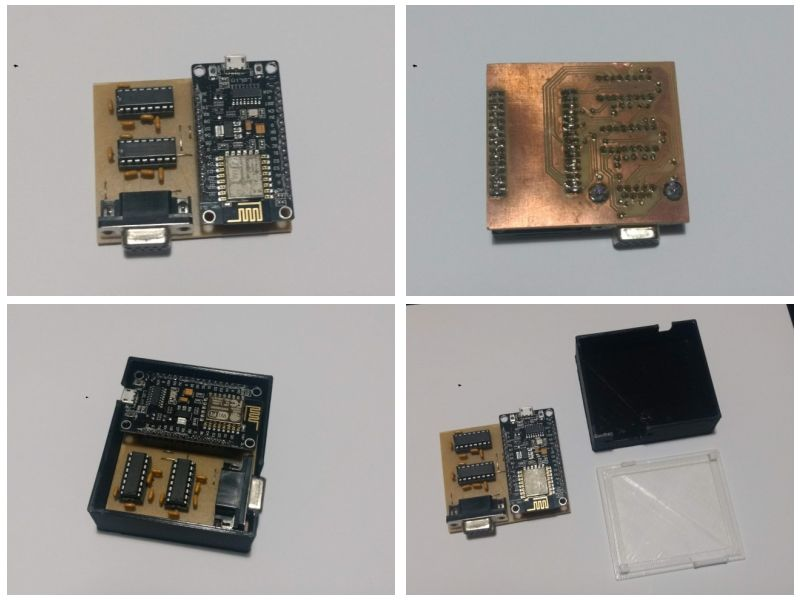
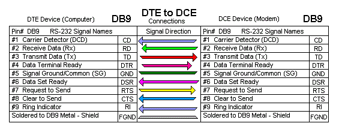

# Telnet4DosFBB
Cliente / Servidor Telnet (Tunel TCP <-> Serial) para DosFBB

Conversor que simula modem teléfonico conectado a puerto serie permitiendo...



# Limitaciones del sistema
1. Una conexión entrante / saliente a la vez: La interfaz de módem telefónico es para conexiones M2M (máquina a máquina).
2. Falso "Telnet": No se reconocen comandos específicos del protocolo, simplemente es un "tunel" TCP <-> Serial.
3. Ancho de banda acotado a interfaz de puerto serial / capacidad de procesamiento de la pc. Con FBBIOS > 1.3 se puede utilizar 56kbps en puerto serie (si la pc lo permite).
4. ...

# Conexionado
El conversor emula (y utiliza) todas las señales de control de un módem estándar.

El cable que debe utilizarse es un DTE <-> DCE con conexión pin a pin (sin inversiones) en los pines: 



Para mayor información consultar la documentación oficial: http://www.f6fbb.org/fbbdoc/fmtphnmo.htm

# Configuración

## BBS

Los usuarios del BBS no tiene autorización por defecto para conectar al BBS a traves del módem (Telnet / TCP en nuestro caso).

El SysOp debe habilitar la autorización para acceso por módem para cada usuario vía el comando de SysOP `EU` (editar usuario), habilitando el flag `M` (de módem) y luego asociando una contraseña con el comando `W`.

## Archivos

Se adjuntan archivos [ejemplo de configuración](config/)

### APPEL.BAT
Debe incluír la inicialización del driver fbbios previo a la carga de 'serv.exe'.

Sintaxis: `FBBIOS [# puerto] [dirección de puerto] [# irq]`.

Para mayor información consultar la documentación oficial: http://www.f6fbb.org/fbbdoc/fmtfbbio.htm

```
fbbios 1 03F8 4
serv %1
```

### PORT.SYS

Cantidad de puertos / TNC acorde al sistema
```
#Ports TNCs
1      1
```

Número de puerto serie, interfaz (3 -> Módem telefónico con FBBIOS), dirección de puerto y velocidad en baudios.
Se utiliza 57600 (máximo soportado por FBBIOS >1.3) para mejor rendimiento aunque puede no ser funcional dependiendo de las capacidades del hardware / pc.
La misma configuración aplica al driver FBBIOS que debe precargarse en APPEL.BAT.

```
#Com Interface Address (device)   Baud
1    3         3F8                57600
```

#### Configuración específica
* NbCh -> 1 (la interfaz soporta 1 canal)
* Com -> acorde a la configuración definida previamente
* M/P-Fwd -> inicio / intervalo de fwd de acuerdo al gusto (se aconseja no ser demasiado agresivo)
* Mode -> UMR (U = Normal, M = Módem telefónico, R = Permite conctar en solo lectura aunque no se tengan las credenciales de acceso).
* El resto de los parámetros son ignorados (creo) por la interfaz.

```
# Same number of lines as TNCs:
#
#TNC NbCh Com MultCh Pacln Maxfr NbFwd MxBloc M/P-Fwd Mode Freq
0    0    0   0      0     0     0     0      00/60   ---- File-fwd.
1    1    1   1      250   1     1     5      10/30   UMR  Telnet
```

### INITTNCx.SYS
Lista de comenados que envía el FBB al inicializar y posterior a una conexión.

Reemplazar `x` por número de TNC (depende de configuración en `PORT.SYS`).

Permite configurar parámetros de inicialización del conversor, tales como:
1. SSID y Contraseña de WiFi.
2. DDNS (duckdns.org).
3. Puerto de escucha de servidor telnet.
4. Estado activo / inactivo (fuera de servicio) del servidor telnet.
5. Reinicio del conversor.

Detalle de comandos soportados:

* `C$host:port` -> `host:port`: Servidor / puerto al que conectar.
* `SSID$ssid` -> `ssid`: SSID del WiFi a conectar
* `PASS$password` -> `password`: Contraseña de la red de WiFi
* `PORT$numero` -> `numero`: Puerto de Telnet (conexiones entrantes)
* `DUCK_DNS_UPDATE_TIME$tiempo` -> `tiempo` -> ...
* `DUCK_DNS_DOMAIN$dominio` -> `dominio`: ...
* `DUCK_DNS_TOKEN$token` -> `token`: ...
* `ONLINE$` -> Conversor "en linea": Atiende las conexiones entrantes)
* `OFFLINE$` -> Conversor "fuera de línea": Rechaza (y saluda) las conexiones entrantes.
* `RESET$` -> Reinicio del conversor
  
### MAINTx.SYS

Lista de comenados que envía el FBB al entrar en modo mantenimiento (DOS Gateway, al salir, etc).

Reemplazar `x` por número de TNC (depende de configuración en `PORT.SYS`).

Comando "utilizable":

* `OFFLINE$` -> Conversor "fuera de línea": Rechaza (y saluda) las conexiones entrantes.

### Archivo de forward

La sintaxis del comando de llamada difiere del utilizado en las versiones de FBB que soportal telnet:
Sintaxis: `^MC$$host:puerto^M`

`^M` previo -> para eliminar otro comando / basura que pueda estar encolado en la interfaz.

`C$$host:puerto` -> Conectar a `host` : `puerto` (si no se especifica este último se utiliza 23).

`^M` final -> para que el comando sea aceptado.

```
C C LW6DIO ^MC$$lw6dio.duckdns.org:6300^M
```

### Parámetros configurables desde el Firmware (código fuente)

```
// Modo depuración
// Utilizado para observar el comportamiento del conversor vía puerto serial.
#define DEBUG_MODE
#define DEBUG_BAUD_RATE                             57600

// Generales
// Velocidad en baudios del puerto serial.
#define SERIAL_BAUDRATE                             57600
// Puerto del servidor TCP (conexiones entrantes)
#define DEFAULT_TELNET_PORT                         6300
// Tiempo de reinicio si el conversor no puede conectarse a WiFi (se asume algún problema en hardware / software / externo y que un reinicio "lo pueda solucionar")
#define WIFI_DISCONNECTED_RESET_TIMEOUT_MINUTES     5.0f
// Tiempo de reinicio por inactividad (idem anterior).
#define WITHOUT_ACTIVITY_RESET_TIMEOUT_MINUTES      90.0f
// Tiempo de desconexión automática por inactividad de clientes (tener en cuenta que una vez iniciada la conexión el FBB no controla el estado del cliente TCP y este es el único método para garantizar la liberación)
#define DEFAULT_CLIENT_INACTIVITY_TIMEOUT_SECONDS   60

// Parámetros internos (no se recomienda la modificación)
#define SERIAL_RX_BUFFER_SIZE                       4096
#define SERIAL_RX_BUFFER_CTS_TARGET                 3072

#define TCP_2_SERIAL_BUFFER_SIZE                    8192
#define TCP_RX_FRAME_TIMEOUT                        50
#define SERIAL_2_TCP_BUFFER_SIZE                    1500  //1460?
#define SERIAL_RX_FRAME_TIMEOUT                     50
```

# Referencias
1. Documentación oficial: http://www.f6fbb.org/fbbdoc/doc.htm
2. Espejo en este repositorio: https://luispichio.github.io/Telnet4DosFBB/ (la documentación oficial suele estar fuera de línea)